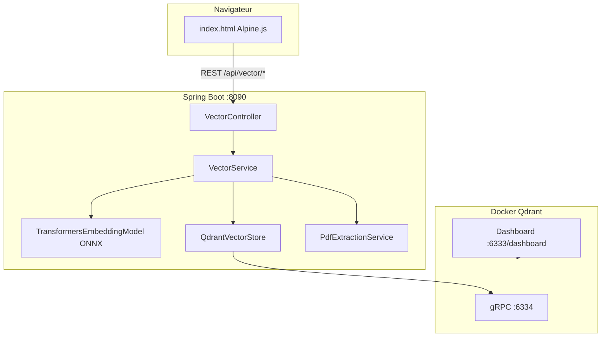

# VectorLab

**Atelier hands-on pour comprendre les embeddings et les bases de données vectorielles, en Java, sans GPU, en local.**

VectorLab est un dépôt pédagogique prêt à l'emploi : une application Spring Boot légère, une interface web interactive et Qdrant avec son dashboard intégré. En une dizaine de minutes, vous passez de « c'est quoi un vecteur ? » à « je cherche par le sens, pas par les mots-clés ».

[](https://openjdk.org/)
[](https://spring.io/projects/spring-boot)
[](https://spring.io/projects/spring-ai)
[](https://qdrant.tech/)
[](LICENSE)


## Pourquoi ce projet ?

Une base relationnelle répond à : *« trouve les lignes où `title LIKE '%chat%'` »*.

Une base vectorielle répond à : *« trouve les textes **proches du sens** de ma question »*, même sans mots communs.

VectorLab rend ce mécanisme **visible** :

| Étape | Ce que vous voyez |
|-------|-------------------|
| Indexation | Un texte devient un vecteur de **384 nombres** |
| Stockage | Qdrant conserve vecteurs + métadonnées |
| Recherche | Une requête est projetée dans le même espace ; les voisins les plus proches remontent |

Tout tourne **en local** (CPU, modèle ONNX ~80 Mo). Aucune clé API, aucun GPU.


## Architecture



**Modèle d'embedding :** [all-MiniLM-L6-v2](https://huggingface.co/sentence-transformers/all-MiniLM-L6-v2), 384 dimensions, rapide, idéal pour l'apprentissage.


## Démarrage rapide (2 minutes)

### Prérequis

- [Java 21](https://adoptium.net/)
- [Docker](https://docs.docker.com/get-docker/)

### Lancement

```bash
# 1. Démarrer Qdrant
docker compose up -d

# 2. Lancer l'application
./mvnw spring-boot:run
```

Au **premier démarrage**, le modèle ONNX est téléchargé (~80 Mo, cache dans `${java.io.tmpdir}/spring-ai-onnx-model`). Comptez 1 à 2 minutes.

| Ressource | URL |
|-----------|-----|
| Interface VectorLab | [http://localhost:8090](http://localhost:8090) |
| Dashboard Qdrant | [http://localhost:6333/dashboard](http://localhost:6333/dashboard) |


## Parcours d'exercices

Ces exercices sont conçus pour un atelier en autonomie ou en groupe. Chaque exercice introduit un concept clé des bases vectorielles.

### Exercice 1 : Du texte au vecteur

**Objectif :** comprendre ce qu'est concrètement un embedding.

1. Ouvrez [http://localhost:8090](http://localhost:8090).
2. Dans la zone **Anatomie d'un Embedding**, tapez : `intelligence artificielle`.
3. Observez la réponse : **384 dimensions**, un tableau de floats.

**Questions de réflexion :**

- Pourquoi deux phrases identiques produisent-elles le même vecteur ?
- Pourquoi le vecteur n'est-il pas « lisible » par un humain ?

**Via l'API :**

```bash
curl -G "http://localhost:8090/api/vector/embed-debug" \
  --data-urlencode "text=intelligence artificielle"
```


### Exercice 2 : Indexer sa première base de connaissances

**Objectif :** alimenter le vector store avec des documents texte.

Indexez ces trois passages (zone 1 de l'interface ou via `curl`) :

| Contenu | Catégorie |
|---------|-----------|
| Les embeddings transforment du texte en coordonnées numériques dans un espace à haute dimension. | Tutoriel |
| Qdrant stocke des vecteurs et permet une recherche par similarité cosinus très rapidement. | Infrastructure |
| Le modèle all-MiniLM-L6-v2 produit des vecteurs de 384 dimensions, optimisés pour la similarité sémantique. | Modèle |

```bash
curl -X POST http://localhost:8090/api/vector/index \
  -H "Content-Type: application/json" \
  -d '{"content":"Les embeddings transforment du texte en coordonnées numériques.","category":"Tutoriel"}'
```

**Vérification :** ouvrez le [dashboard Qdrant](http://localhost:6333/dashboard) → collection `ged-documents` → vous devez voir de nouveaux **points** avec payload (texte + métadonnées).


### Exercice 3 : Recherche sémantique (sans mots-clés)

**Objectif :** constater que la recherche fonctionne **par le sens**, pas par correspondance lexicale.

1. Sans réindexer, lancez une recherche avec :  
   `Comment représenter le sens d'une phrase en mathématiques ?`
2. Comparez avec une recherche mot à mot classique : aucun document ne contient exactement ces mots.

**Ce qui se passe :**

```
Requête -> EmbeddingModel -> vecteur requête
                                        │
                    Qdrant compare (cosinus / distance)
                                        │
                    Documents les plus proches remontent
```

**Via l'API :**

```bash
curl -G "http://localhost:8090/api/vector/search" \
  --data-urlencode "query=Comment représenter le sens d'une phrase ?" \
  --data-urlencode "topK=3" \
  --data-urlencode "threshold=0.3"
```

**Défi :** trouvez une requête qui ne matche **aucun** document (score faible). Que se passe-t-il si vous baissez `threshold` à `0.1` ?


### Exercice 4 : Seuil de similarité et Top-K

**Objectif :** comprendre les paramètres `threshold` et `topK`.

| Paramètre | Rôle |
|-----------|------|
| `topK` | Nombre maximum de résultats retournés |
| `threshold` | Score minimum de similarité (filtre les résultats trop éloignés) |

**Manipulation :**

```bash
# Strict : peu de résultats
curl -G "http://localhost:8090/api/vector/search" \
  --data-urlencode "query=bases de données vectorielles" \
  --data-urlencode "threshold=0.7" --data-urlencode "topK=5"

# Permissif : plus de résultats, parfois moins pertinents
curl -G "http://localhost:8090/api/vector/search" \
  --data-urlencode "query=bases de données vectorielles" \
  --data-urlencode "threshold=0.2" --data-urlencode "topK=5"
```

Notez l'évolution du **score** affiché dans l'interface (pourcentage de proximité).


### Exercice 5 : Métadonnées et traçabilité

**Objectif :** voir comment les métadonnées enrichissent chaque point vectoriel.

1. Indexez deux documents avec des **catégories différentes** (`Sciences` vs `Culture`).
2. Lancez une recherche large.
3. Dans les résultats UI, repérez le badge **Catégorie**.

Chaque point Qdrant contient :

```json
{
  "category": "Tutoriel",
  "sourceType": "text"
}
```

Pour un PDF indexé, vous verrez en plus : `filename`, `chunkIndex`, `totalChunks`.

**Piste avancée :** dans le dashboard Qdrant, inspectez le **payload** d'un point et comparez-le au texte affiché dans l'UI.


### Exercice 6 : Importer un PDF (chunking)

**Objectif :** comprendre pourquoi on découpe les longs documents avant indexation.

1. Préparez un PDF texte (article, slides exportés, documentation).
2. Importez-le via l'interface ou :

```bash
curl -X POST http://localhost:8090/api/vector/index-pdf \
  -F "file=@mon-article.pdf" \
  -F "category=Documentation"
```

Réponse type :

```json
{
  "filename": "mon-article.pdf",
  "chunksIndexed": 12,
  "charactersExtracted": 8543
}
```

**Questions :**

- Pourquoi un long PDF produit-il **plusieurs chunks** ?
- Pourquoi deux chunks du même PDF peuvent-ils apparaître dans une même recherche ?
- Que se passe-t-il si le PDF est une image scannée sans couche texte ? *(Indice : extraction vide → erreur 400)*

Configuration du découpage dans `application.yml` :

```yaml
vector-lab:
  pdf:
    chunk-size: 800      # caractères par chunk
    chunk-overlap: 100   # recouvrement entre chunks
```


### Exercice 7 : Explorer Qdrant comme un développeur

**Objectif :** relier l'abstraction Spring AI à la réalité du vector store.

1. Ouvrez [http://localhost:6333/dashboard](http://localhost:6333/dashboard).
2. Naviguez vers la collection **`ged-documents`**.
3. Observez :
   - la **dimension** des vecteurs (384),
   - la métrique de distance (**Cosine**),
   - le nombre de points après chaque indexation.

**Expérience :** indexez un document, rafraîchissez le dashboard, puis supprimez la collection et relancez l'app (`initialize-schema: true` recrée la collection au prochain ajout).


## API REST

| Méthode | Endpoint | Description |
|---------|----------|-------------|
| `POST` | `/api/vector/index` | Indexer un texte (`content`, `category`) |
| `POST` | `/api/vector/index-pdf` | Indexer un PDF (`file`, `category` optionnel, max 10 Mo) |
| `GET` | `/api/vector/embed-debug?text=` | Aperçu de l'embedding (384 dims) |
| `GET` | `/api/vector/search?query=&threshold=0.3&topK=3` | Recherche par similarité |


## Stack technique

| Couche | Technologie |
|--------|-------------|
| Runtime | Java 21 |
| Framework | Spring Boot 3.4, Spring AI 1.0 |
| Embeddings | all-MiniLM-L6-v2 (ONNX, CPU, local) |
| Vector store | Qdrant v1.10 (Docker) |
| PDF | Apache PDFBox 3.x |
| Frontend | HTML, Tailwind CSS, Alpine.js |
| CI | GitHub Actions (Maven verify) |


## Structure du projet

```
├── docker-compose.yml          # Qdrant local
├── pom.xml
└── src/main/
    ├── java/com/edu/vectorlab/
    │   ├── VectorLabApplication.java
    │   ├── controller/VectorController.java
    │   ├── model/                # DTOs (records)
    │   └── service/              # VectorService, PdfExtractionService
    └── resources/
        ├── application.yml
        └── static/index.html     # Interface atelier
```


## Dépannage

| Problème | Solution |
|----------|----------|
| L'app ne démarre pas, erreur Qdrant | Vérifiez `docker compose ps` : Qdrant doit être up |
| Port 8090 occupé | Changez `server.port` dans `application.yml` |
| Premier démarrage très lent | Normal : téléchargement du modèle ONNX |
| PDF sans texte extractible | Utilisez un PDF avec couche texte (pas un scan image) |
| Warning version client Qdrant | Non bloquant en atelier ; Qdrant v1.10 fonctionne |


## Aller plus loin

Après VectorLab, vous pouvez explorer :

- **RAG complet** : récupération vectorielle + LLM pour générer une réponse
- **Filtres metadata** : Spring AI `FilterExpression` sur Qdrant
- **Autres vector stores** : PgVector, Chroma, Redis
- **Modèles multilingues** : `paraphrase-multilingual-MiniLM-L12-v2`


## Licence

Ce projet est distribué sous licence [Apache License 2.0](LICENSE).

Vous êtes libre de l'utiliser, le modifier et le redistribuer pour vos ateliers, formations et démos, conformément aux termes de la licence.


<p align="center">
  <strong>VectorLab</strong> : Apprendre les bases vectorielles en manipulant, pas en théorisant.
</p>
